  
  
  
  

**Yaksera Solutions Pvt. Ltd.** is an IT outsourcing and software development partner. We design, build and ship web apps, mobile apps and AI automation for businesses worldwide, from idea to deployment and beyond.

### What we do

| | |
| --- | --- |
| 🌐 **Web Development** | Scalable, secure, fast web applications on modern stacks |
| 📱 **Mobile Apps** | High-performance iOS and Android experiences |
| 🤖 **AI Automation** | Agents and workflows that cut repetitive work and speed up operations |
| 🎨 **UI/UX Design** | Pixel-perfect, user-centered interfaces, from Figma to production |

### 🤖 AI & SaaS products

| Project | What it does | Stack |
| --- | --- | --- |
| [**StoreOps AI**](https://github.com/yaksera/storeops-ai) | Real-time AI operations team for Shopify stores. Agents handle orders, inventory, carts and support, and route risky actions to the merchant for approval. | FastAPI · Next.js · Redis · SQLAlchemy · Docker |
| [**Prospectra AI**](https://github.com/yaksera/prospectra-ai) | Seven AI agents that find leads, write and review outreach, and book calls, with every step streamed live. | FastAPI · Next.js · n8n |
| [**OmniInbox**](https://github.com/yaksera/omni-inbox) | One inbox for WhatsApp, Instagram, Messenger, TikTok, Telegram, Discord and email. Multi-tenant SaaS. | Django REST · Next.js · JWT |
| [**TubeSift**](https://github.com/yaksera/Tubesift) | YouTube channel scraper with Latest and Popular tabs. Collects titles, view counts and links in resumable batches, so each scrape continues where the last one stopped. | FastAPI · Next.js · yt-dlp · SQLite |

### ✨ Websites & motion

| Project | Live | Stack |
| --- | --- | --- |
| [**Smile Care**](https://github.com/yaksera/smilecare): dental clinic site with booking and CMS-editable content | [demo](https://smilecare-pi.vercel.app) | Next.js · Django · GSAP |
| [**Move Fits**](https://github.com/yaksera/Movefits): pixel-matched Figma build with smooth-scroll animation | [demo](https://movefits.vercel.app) | Next.js · Django · GSAP |
| [**Xtreme Energy 3D**](https://github.com/yaksera/xtreme-energy-3d): 3D can that spins and skydives on scroll | [demo](https://portfolio104.vercel.app) | Next.js · React Three Fiber · GSAP |
| [**Krishna: The Divine Journey**](https://github.com/yaksera/krishnajanma): cinematic scroll story | [demo](https://krishnajanma.vercel.app) | Next.js · GSAP · R3F · Lenis |
| [**Elite Fitness**](https://github.com/yaksera/elite-fitness): yoga studio site with a WebGL scene | [demo](https://elite-fitness-plum.vercel.app) | Next.js · Three.js · GSAP |
| [**Nimbu Paani**](https://github.com/yaksera/nimbupani): art-directed product story | [demo](https://nimbupani-green.vercel.app) | Next.js · GSAP · R3F |

### 🔒 Private & client work

Much of our work is under NDA or not public yet, so the code stays private. Summaries are below, and **walkthroughs and code reviews are available on request** under NDA.

| Project | What it is | Stack | Status |
| --- | --- | --- | --- |
| **Himalayan Woods** | Full-stack commerce platform for handcrafted Himalayan furniture: storefront, cart, location-aware delivery pricing, checkout, plus admin dashboards for catalog, inventory, orders, payments and audit history | FastAPI · PostgreSQL · SQLAlchemy (async) · Alembic · JWT + Argon2 · Docker · Next.js | Backend complete with 170+ automated tests; frontend in progress |
| **Caloriexe** | AI calorie and nutrition tracker: guided onboarding, personalised plans and targets, meal logging with food photos, and a Gemini-powered nutrition assistant | Next.js · FastAPI · PostgreSQL · Alembic · Google Gemini · Google sign-in · Cloudinary · Recharts | In development |
| **Yakwoods** | Storefront API for a wood-products brand | FastAPI · Python | In development |
| **RAG Chatbot** | Private document Q&A that runs fully on local models, with an evaluation suite to measure answer quality | FastAPI · Ollama · sentence-transformers · FAISS / Chroma | Prototype |
| **Vision-to-Speech (Nepali)** | Detects objects in a photo and announces them aloud in Nepali, an accessibility prototype | YOLO11 · Python · Google Translate · gTTS | Prototype |

### 🛠️ Our stack

  

**Frontend:** Next.js · React · TypeScript · Tailwind CSS · GSAP · Three.js / React Three Fiber · Framer Motion 
**Mobile:** Flutter 
**Backend:** Python · Django & Django REST Framework · FastAPI · PostgreSQL · Redis 
**AI & automation:** LLM agents · RAG · n8n 
**Delivery:** Git · Docker · Vercel · Render

### 🐍 Always shipping

<picture>
  <source media="(prefers-color-scheme: dark)" srcset="https://raw.githubusercontent.com/yaksera/yaksera/output/snake-dark.svg">
  
</picture>

